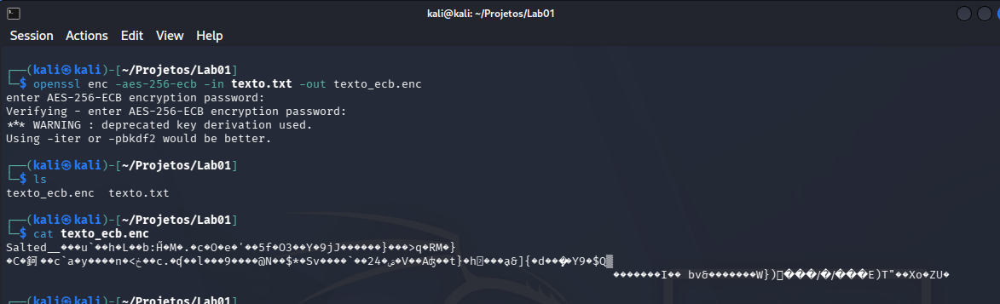
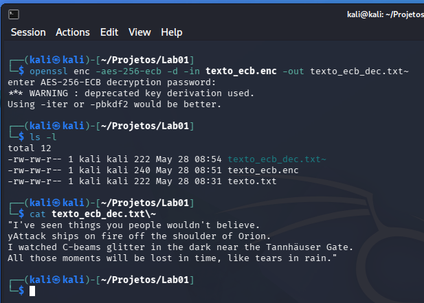
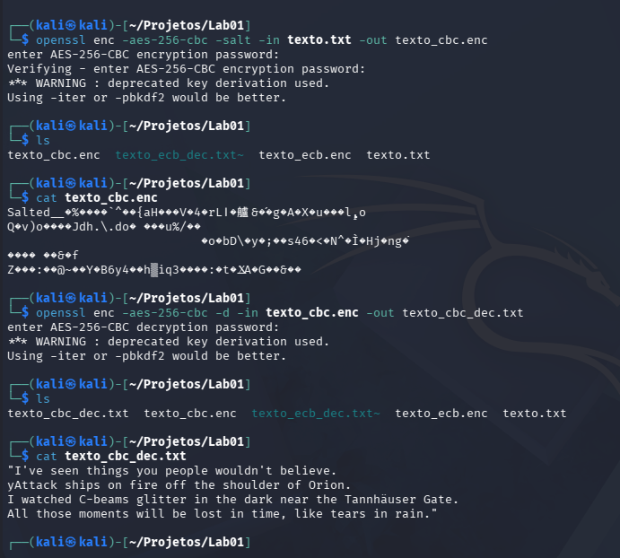
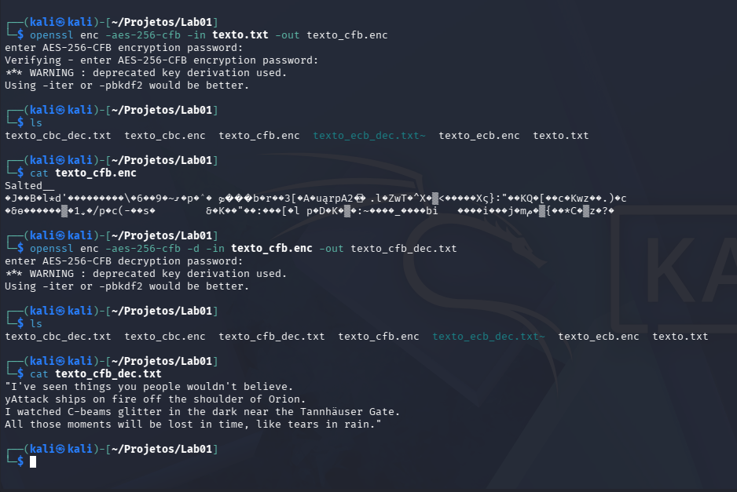
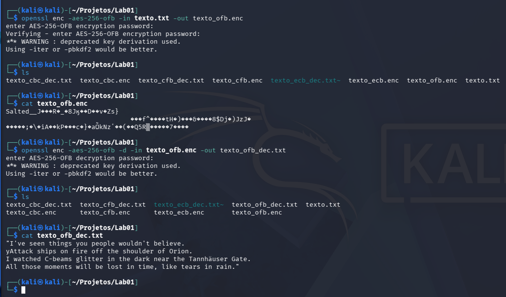
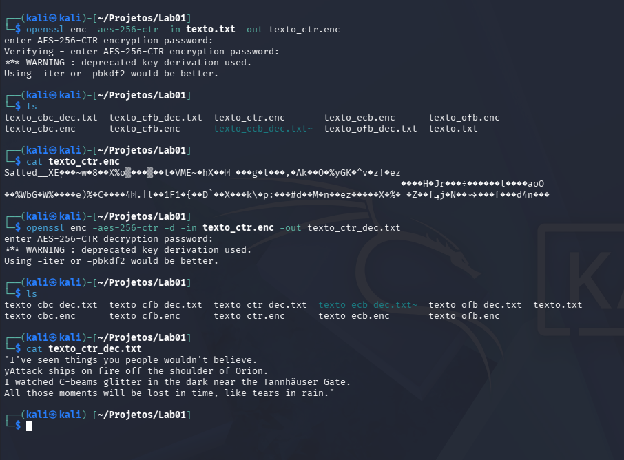
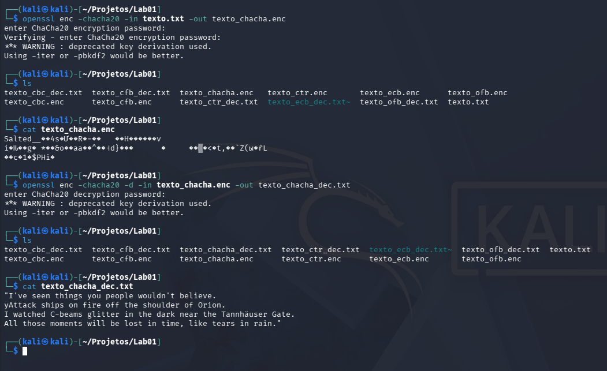
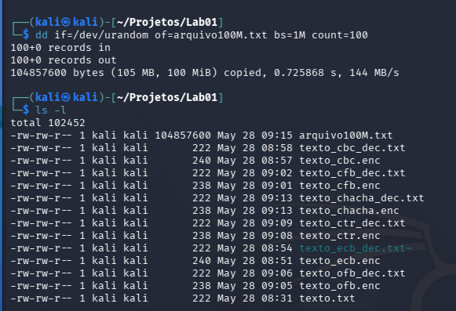
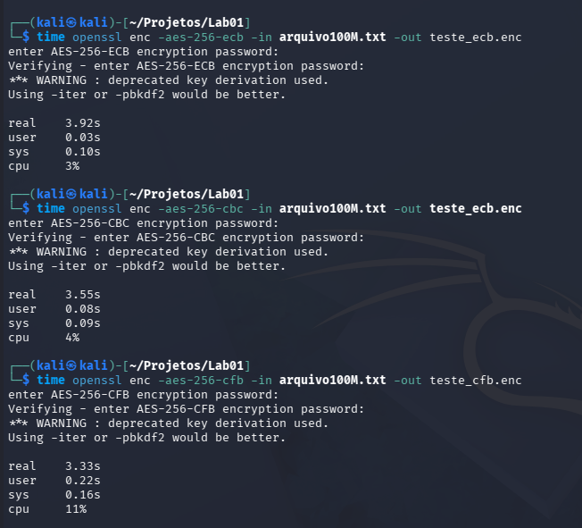
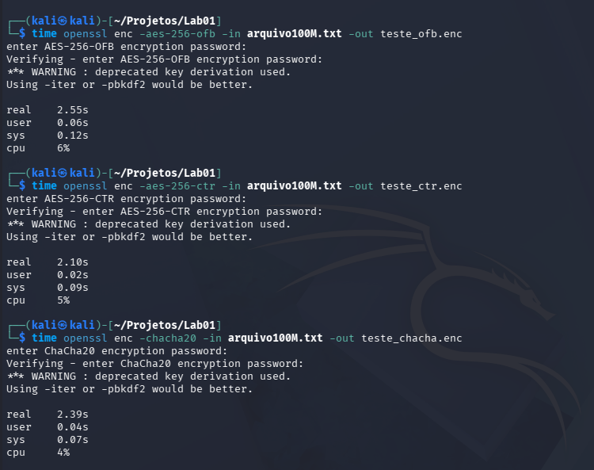

# Laboratório de criptografia simetrica. 

## Objetivo 
Explorar o funcionamento do AES em todos os modos de operação disponíveis no OpenSSL, além de comparar com o algoritmo moderno ChaCha20. Avaliar diferenças de segurança, desempenho e aplicabilidade em redes de comunicação.

## Preparação 
Primeiro criamos o arquivo .txt 

```
"I've seen things you people wouldn't believe. Attack ships on fire off the shoulder of Orion. I watched C-beams glitter in the dark near the Tannhäuser Gate. All those moments will be lost in time, like tears in rain."
```

## AES em todos os modos de Operação 

### 1. AES-256-ECB (Electronic Codebook)
Usamos o comando abaixo para criptografar o arquivo de texto: 
```
openssl enc -aes-256-ecb -in texto.txt -out texto_ecb.enc
```


Para decodificar usamos: 
```
openssl enc -aes-256-ecb -d -in texto_ecb.enc -out texto_ecb_dec.txt
```


### 2. AES-256-CBC (Cipher Block Chaining)
Para criptografar: 
```
openssl enc -aes-256-cbc -salt -in texto.txt -out texto_cbc.enc
```
Para decodificar:
```
openssl enc -aes-256-cbc -d -in texto_cbc.enc -out texto_cbc_dec.txt
```


### 3. AES-256-CFB (Cipher Feedback)
Para criptografar: 
```
openssl enc -aes-256-cfb -in texto.txt -out texto_cfb.enc
```
Para decodificar:
```
openssl enc -aes-256-cfb -d -in texto_cfb.enc -out texto_cfb_dec.txt
```


### 4. AES-256-OFB (Output Feedback)
Para criptografar: 
```
openssl enc -aes-256-ofb -in texto.txt -out texto_ofb.enc
```
Para decodificar:
```
openssl enc -aes-256-ofb -d -in texto_ofb.enc -out texto_ofb_dec.txt
```


### 5. AES-256-CTR (Counter Mode)
Para criptografar: 
```
openssl enc -aes-256-ctr -in texto.txt -out texto_ctr.enc
```
Para decodificar:
```
openssl enc -aes-256-ctr -d -in texto_ctr.enc -out texto_ctr_dec.txt
```


A mesma senha foi utilizado para criptografar todos os arquivos: blade 

## Parte 3 – ChaCha20
Para criptografar: 
```
openssl enc -chacha20 -in texto.txt -out texto_chacha.enc
```
Para decodificar: 
```
openssl enc -chacha20 -d -in texto_chacha.enc -out texto_chacha_dec.txt
```


## Parte 4 – Experimento de Performance
Primeiro iremos gerar um arquivo de teste com 100mb para medirmos o tempo de cifragem de cada modo. 


Para medirmos o tempo de cada cifragem usaremos o comando para cada algoritmo de criptografia:
``` 
time openssl enc -algoritmo -in arquivo100M.txt -out saida
```



# Questões 

1. Qual modo de operação apresentou melhor desempenho?
O modo AES-256-CTR foi o mais rápido, concluindo a tarefa em 2,10 segundos. O segundo melhor foi o ChaCha20, com 2,39 segundos.  

2. Por que o ECB é considerado inseguro mesmo sendo rápido?
Porque ele cifra blocos de dados idênticos sempre gerando o mesmo resultado cifrado. Isso falha em ocultar os padrões e a estrutura da informação original (como os contornos de uma imagem, por exemplo).

3. Quais modos são mais adequados para redes de comunicação?
O CTR (Counter Mode) é o mais indicado, pois permite o processamento em paralelo e serve de base para padrões modernos e autênticos como o AES-GCM. O ChaCha20 também é amplamente recomendado para redes.

4. O que diferencia o ChaCha20 do AES em termos de eficiência e segurança?
Ambos são extremamente seguros. A diferença está na eficiência: o AES é muito mais rápido em dispositivos com suporte nativo de hardware (processadores modernos com AES-NI), enquanto o ChaCha20, que é uma cifra de fluxo, foi otimizado para rodar de forma extremamente veloz via software em dispositivos mais simples (IoT, roteadores, celulares mais antigos).

5. Como essa prática se relaciona com protocolos como TLS, IPsec e VPNs modernas?
Protocolos como TLS e IPsec utilizam exatamente esses algoritmos simétricos (AES e ChaCha20) para fazer o "trabalho pesado". Após uma troca inicial de chaves, eles são os responsáveis por criptografar todo o volume de dados trafegados na conexão de forma rápida e confidencial.  
