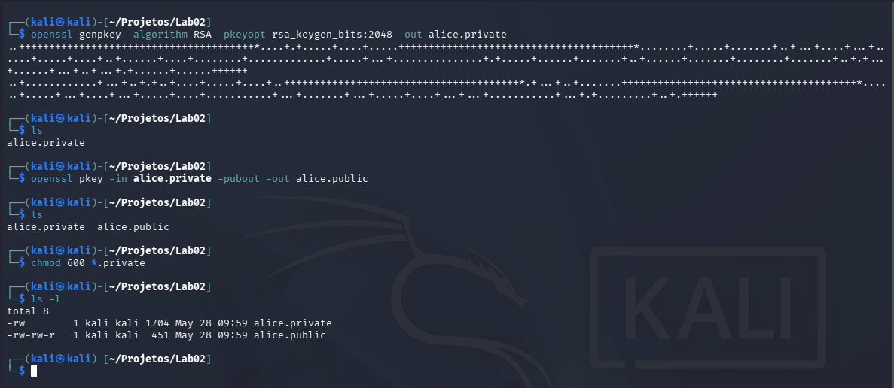
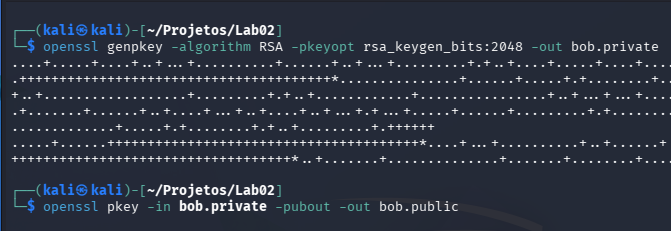
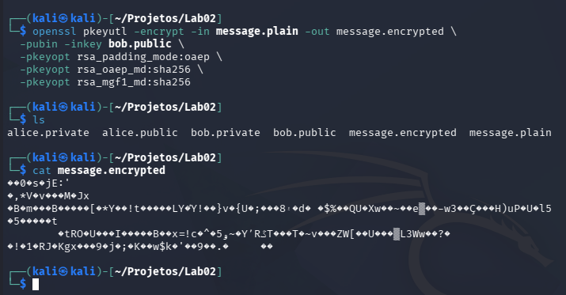
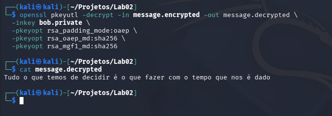
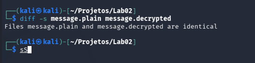
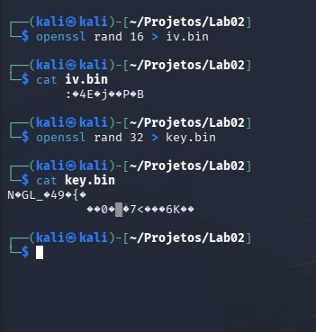
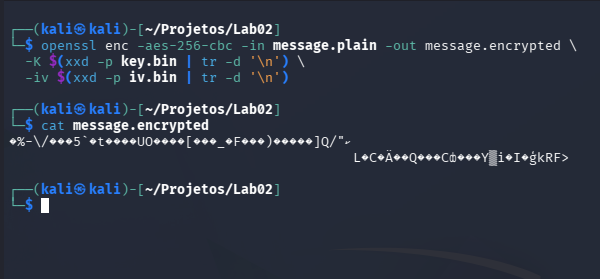
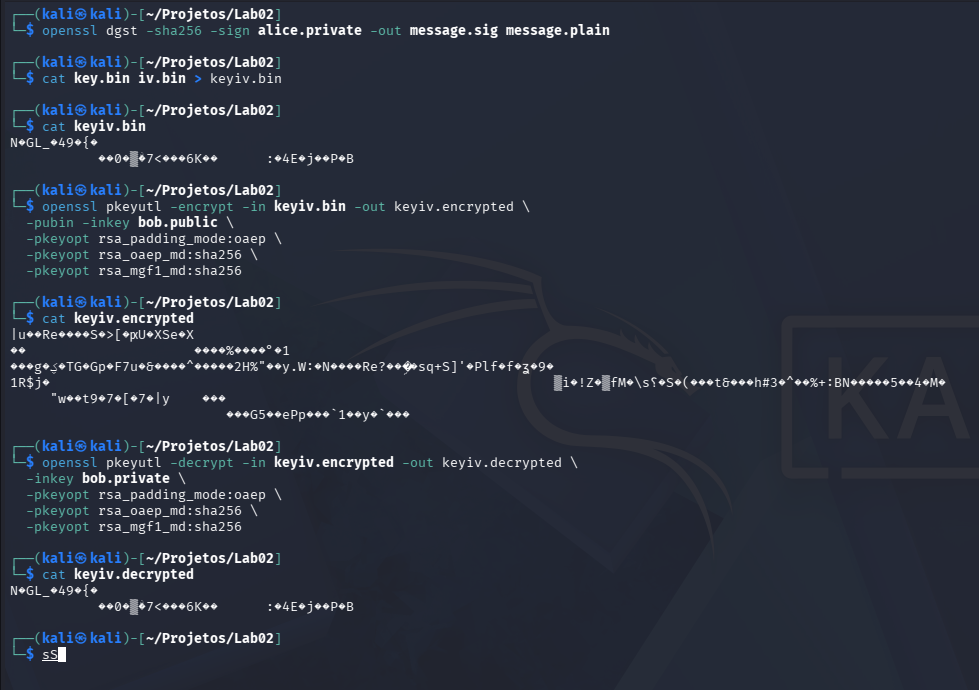
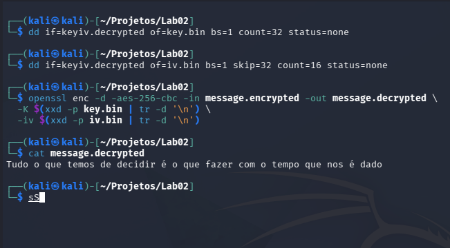
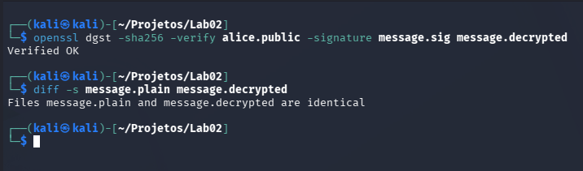

# Laboratório de criptografia assimetrica. 

## Objetivo 
O objetivo desta atividade é que cada aluno produza um documento em formato PDF apresentando os resultados obtidos no laboratório de criptografia com OpenSSL.

## 1) Geração de chaves RSA

Primeiro iremos gera uma chave privada para Alice utilizando o comando:
``` 
openssl genpkey -algorithm RSA -pkeyopt rsa_keygen_bits:2048 -out alice.private
```
Depois uma chave publica para Alice:
``` 
openssl pkey -in alice.private -pubout -out alice.public
```
Depois alteramos as permissões do arquivo para que apenas Alice possa ler e escrever os arquivos .private 
```
chmod 600 *.private
``` 


Agora iremos seguir os mesmos passos para criar as chaves de Bob 


Criamos um arquivo mesage.plain com a seguinte mensagem 

``` 
Tudo o que temos de decidir é o que fazer com o tempo que nos é dado.
``` 

## 2)Mensagem curta confidencial (Alice → Bob)
Agora iremos encriptar a mensagem utilizando o comando: 
```
openssl pkeyutl -encrypt -in message.plain -out message.encrypted \
  -pubin -inkey bob.public \
  -pkeyopt rsa_padding_mode:oaep \
  -pkeyopt rsa_oaep_md:sha256 \
  -pkeyopt rsa_mgf1_md:sha256
```


Para decodificar a mensagem utilizaremos: 
```
openssl pkeyutl -decrypt -in message.encrypted -out message.decrypted \
  -inkey bob.private \
  -pkeyopt rsa_padding_mode:oaep \
  -pkeyopt rsa_oaep_md:sha256 \
  -pkeyopt rsa_mgf1_md:sha256
```



Comparando para ver se o arquivo da mensagem e arquivo decodificado são idênticos 

## 3) Mensagem curta assinada (Bob → Alice)
Agora iremos gerar um arquivo com uma assinatura digiral utilizando o comando: 
```
openssl dgst -sha256 -sign bob.private -out message.sig message.plain
``` 
E depois verificaremos a assinatura utilizando a chave de Bob
```
openssl dgst -sha256 -verify bob.public -signature message.sig message.plain
```
[!img6](Imagens/img6.png)

## 4) Mensagem grande - cifra híbrida (Alice → Bob)

Primeiro criaramos o vetor aleatório para garantir mais aletoriedade e segurança e depois encriptar a mensagem 



Agora precisamo seguir uma serie de passos para garantir a segurança do nosso arquivo 
```
openssl dgst -sha256 -sign alice.private -out message.sig message.plain
```
Assinatura da mensagem longa com SHA-256 e chave privada da Alice.
```
cat key.bin iv.bin > keyiv.bin
```
concatena chave + IV em um único arquivo binário.

```
openssl pkeyutl -encrypt -in keyiv.bin -out keyiv.encrypted \
  -pubin -inkey bob.public \
  -pkeyopt rsa_padding_mode:oaep \
  -pkeyopt rsa_oaep_md:sha256 \
  -pkeyopt rsa_mgf1_md:sha256
```

cifra chave+IV com a chave pública do Bob, usando RSA-OAEP.

```
openssl pkeyutl -decrypt -in keyiv.encrypted -out keyiv.decrypted \
  -inkey bob.private \
  -pkeyopt rsa_padding_mode:oaep \
  -pkeyopt rsa_oaep_md:sha256 \
  -pkeyopt rsa_mgf1_md:sha256
```

Bob decifra chave+IV com sua chave privada.


```
dd if=keyiv.decrypted of=key.bin bs=1 count=32 status=none
dd if=keyiv.decrypted of=iv.bin bs=1 skip=32 count=16 status=none

```
Extrai os 32 primeiros bytes (chave AES) e depois pula 32 bytes (chave) e copia os 16 seguintes (IV).
```

openssl enc -d -aes-256-cbc -in message.encrypted -out message.decrypted \
  -K $(xxd -p key.bin | tr -d '\n') \
  -iv $(xxd -p iv.bin | tr -d '\n')
```

Por fim deciframos a mensagem 


No final podemos verificar se o arquivo que foi decifrado é o mesmo que o arquivo original 

